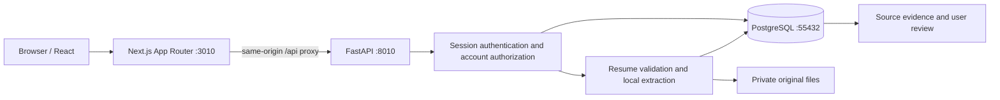

# Architecture

## Runtime

The browser carries an opaque HttpOnly session cookie. Only its SHA-256 digest is stored in PostgreSQL. Every private query filters on the authenticated user. Session deletion revokes the token at logout. Cross-origin writes are rejected. Authentication uses Argon2 hashing. The frontend never receives provider secrets or filesystem keys.

PDF and DOCX files are capped at 5 MB; PDFs at 30 pages; extracted text at 100,000 characters; DOCX expanded content at 30 MB. Corrupt files return a controlled 422 error. Image-only PDFs use high-resolution local Tesseract OCR when installed; encrypted PDF decryption remains unsupported. Parsing is synchronous in FastAPI's worker thread; deployment needs a resource-limited worker process for hostile documents.

Uploads write an immutable version and extracted facts in one database transaction. File writes are removed if persistence fails. Re-upload invalidates profile review. Accepted facts are tied to a specific resume version; the latest version is the active master. Original extraction JSON remains immutable while fact acceptance is stored separately.

## Implemented data model

| Table | Purpose |
|---|---|
| users | Email identity and password hash |
| sessions | Expiring, revocable login sessions |
| candidate_profiles | User-entered personal data, preferences, review state |
| resume_versions | Private storage key, SHA-256, original text and structured extraction |
| candidate_facts | Evidence-backed fields by category, with acceptance state |
| audit_logs | Profile/resume events without document contents or secrets |

All have UUID primary keys and timezone-aware created/updated timestamps. User ownership and foreign-key queries are indexed. Facts normalize skills, projects, education, experience, certifications and achievements into a shared evidence relation for Phase 1. Specialized tables can be added when their own query patterns emerge.

## Folder responsibilities

- `frontend/app`: route entry points, metadata, layout and theme tokens.
- `frontend/components`: authentication, onboarding, reusable brand and workspace UI.
- `frontend/components/ui`: shadcn-owned primitives.
- `frontend/lib`: same-origin API client and explicitly fictional demo fixtures.
- `backend/app/api`: authenticated REST endpoints.
- `backend/app/core`: configuration, sessions and database lifecycle.
- `backend/app/models`: SQLAlchemy entities.
- `backend/app/schemas`: input validation and evidence contracts.
- `backend/app/services`: local parsing and the future provider boundary.
- `backend/app/agents`: future agent state contract, not an active agent.
- `backend/app/workflows`: durable workflow design for Phase 4.
- `backend/migrations`: Alembic version history.
- `tests`: extraction and account isolation integration coverage.

## AI and truth boundaries

A extracted skill means the source mentions it. No years, employers or proficiency are inferred. Section extraction preserves source lines rather than generating summaries. Known negated phrases are excluded, but this is not a comprehensive language understanding model. Users review the original context.

`validate_claim` is a deliberately strict exact-evidence utility, not a completed semantic Truth Guard. Future tailoring must resolve accepted evidence IDs, validate every atomic claim, prohibit unsupported additions and block publication on failure. The current application does not generate tailored claims.

Gemini uses the official `google-genai` SDK behind a backend-only provider boundary. Assistant and mock-interview requests remain evidence-grounded and fall back explicitly when provider calls fail. Provider quotas, distributed rate limits and live-call evaluation remain deployment responsibilities.

## Future database families

Jobs -> job_skills / job_requirements -> job_matches -> skill_gap_occurrences -> skill_recommendations.

Applications -> application_answers / application_events -> immutable resume version -> explicit approval record.

Agent_runs -> durable checkpoints -> audit_logs / notifications.

These tables belong in later migrations when their behavior is implemented. There are no fake active services or empty endpoints that report success.

## Known engineering limits

Rate limiting is process-local and behind the Next.js proxy clients share the proxy address. This is acceptable for the local demo only; production needs a trusted-proxy-aware distributed limiter. Password reset is explicitly unavailable. Private filesystem storage inherits host ACLs; deploy with dedicated service-user permissions/encryption. Review is not yet protected against simultaneous uploads from two tabs; version-bound optimistic concurrency should precede tailoring and approvals. Only loopback services were exercised.
